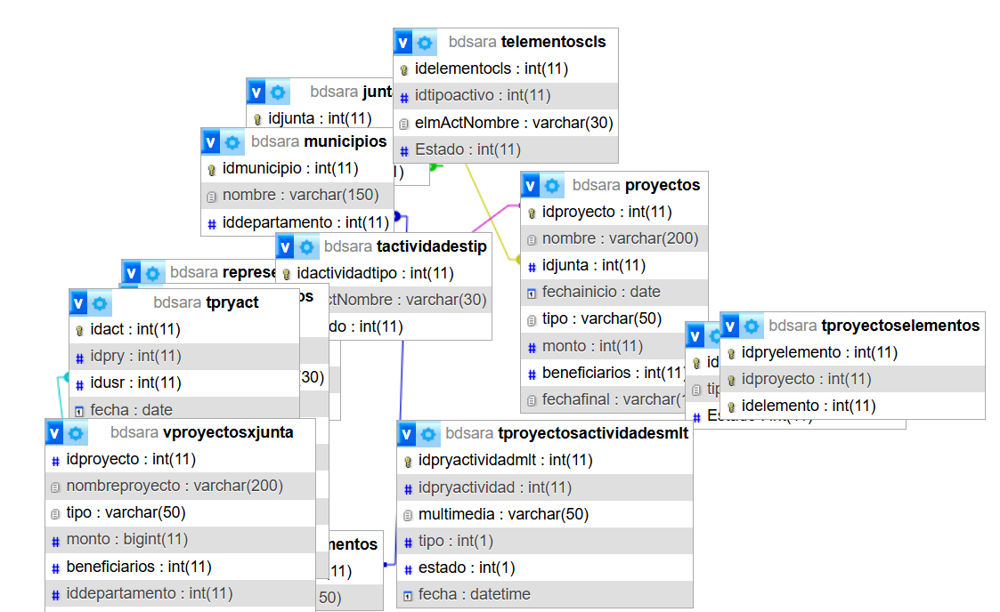

# Arquitectura del Sistema SARA

## 1. Modelo de Dominio (UML de Clases)

La Figura 1 representa el modelo de dominio del sistema SARA, mostrando
las entidades principales y sus relaciones.

    Departamento {
    Municipio {
    Junta {
    Proyecto {
    Actividad {
    Elemento {

